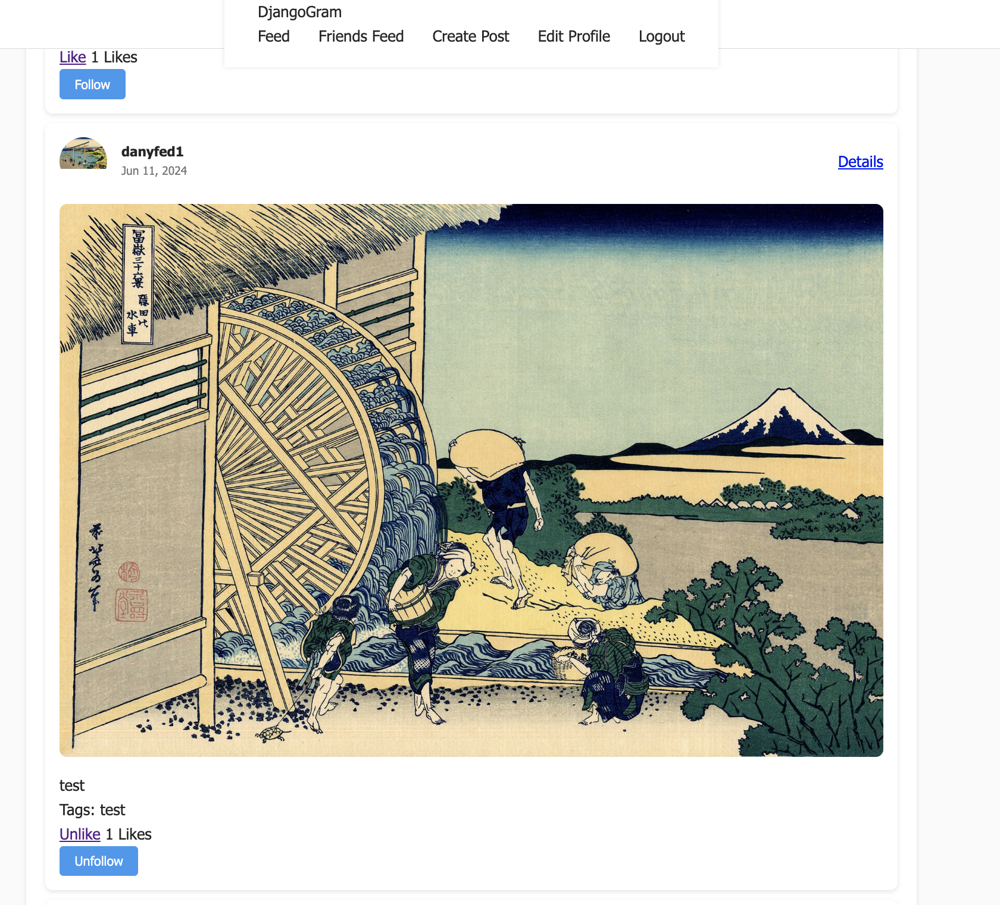

# DjangoGram-Project

DjangoGramm is a web application inspired by Instagram. It allows users to register, create profiles, post images, like posts, and interact with each other. This project demonstrates the use of Django for backend development, Bootstrap for frontend styling, and Google Cloud for deployment.

## Features

* User registration with email verification
* Profile management (full name, bio, avatar)
* Create and view posts with multiple images and tags
* Like and unlike posts
* Responsive design using Bootstrap
* Deployment on Google Cloud

## Technologies and Tools Used

### Backend

* Django: Web framework for building the application
* PostgreSQL: Database for storing user and post data
* Gunicorn: WSGI HTTP server for running the Django application
* django-allauth: Library for authentication, registration, and account management

### Frontend

* Bootstrap: Frontend framework for responsive design
* HTML/CSS: Markup and styling of the web pages
* JavaScript: For handling like/unlike interactions

### Cloud Services

* Google Cloud Platform (GCP): For deployment and hosting
    * Google App Engine: For running the web application
    * Google Cloud SQL: Managed PostgreSQL database
    * Google Cloud Storage: For storing user-uploaded media files

## Project Structure (simplified)

```plaintext
DjangoGram/
├── accounts/                 # User authentication and profile management
├── posts/                    # Post creation and management
├── static/                   # Static files (CSS, JS, images)
├── templates/                # HTML templates
│   ├── account/              # Templates for user authentication
│   ├── allauth/              # Templates for django-allauth
│   ├── socialaccount/        # Templates for social account authentication
├── media/                    # Uploaded media files
├── manage.py                 # Django management script
├── requirements.txt          # Python dependencies
├── settings.py               # Django settings file
└── urls.py                   # URL routing
```

# Implementation Details

## User Registration and Authentication
* django-allauth is used for handling user registration, authentication, and email verification. Users receive an email with a unique link for verification. Once verified, they can complete their profile.

## Profile Management
* Users can manage their profile information, including their full name, bio, and avatar. This functionality is implemented in the accounts app.

## Post Creation and Viewing
* Users can create posts with multiple images and tags. Posts are displayed in a feed where users can view and interact with them. This functionality is implemented in the posts app.

## Likes and Interactions
* Users can like and unlike posts. This functionality is handled using JavaScript for a seamless user experience.




